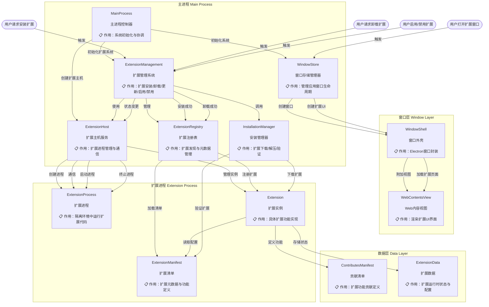
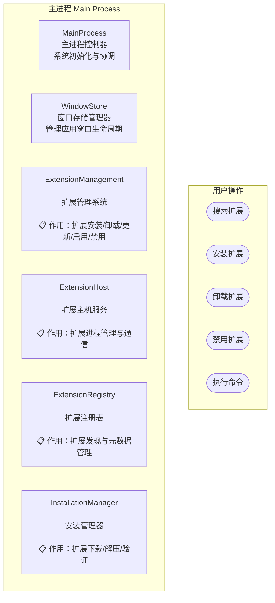

# Extension Architecture Design

## Flow Diagram

```mermaid
flowchart TB
    subgraph "主进程 Main Process"
        MP[MainProcess
        <br />主进程控制器
        <br />📋 作用：系统初始化与协调]

        WS[WindowStore
        <br />窗口存储管理器
        <br />📋 作用：管理应用窗口生命周期]

        EM[ExtensionManagement
        <br />扩展管理系统
        <br />📋 作用：扩展安装/卸载/更新/启用/禁用]

        EH[ExtensionHost
        <br />扩展主机服务
        <br />📋 作用：扩展进程管理与通信]

        ER[ExtensionRegistry
        <br />扩展注册表
        <br />📋 作用：扩展发现与元数据管理]

        IM[InstallationManager
        <br />安装管理器
        <br />📋 作用：扩展下载/解压/验证]
    end

    subgraph "窗口层 Window Layer"
        WSHELL[WindowShell
        <br />窗口外壳
        <br />📋 作用：Electron窗口封装]

        WV[WebContentsView
        <br />Web内容视图
        <br />📋 作用：渲染扩展UI界面]
    end

    subgraph "扩展进程 Extension Process"
        EP[ExtensionProcess
        <br />扩展进程
        <br />📋 作用：隔离环境中运行扩展代码]

        EXT[Extension
        <br />扩展实例
        <br />📋 作用：具体扩展功能实现]

        EMAN[ExtensionManifest
        <br />扩展清单
        <br />📋 作用：扩展元数据与功能定义]
    end

    subgraph "数据层 Data Layer"
        CM[ContributesManifest
        <br />贡献清单
        <br />📋 作用：扩展功能贡献定义]

        EXTD[ExtensionData
        <br />扩展数据
        <br />📋 作用：扩展运行时状态与配置]
    end

    %% 主流程
    MP -->|初始化系统| WS
    MP -->|初始化扩展系统| EM
    MP -->|创建扩展主机| EH

    EM -->|使用| EH
    EM -->|管理| ER
    EM -->|调用| IM

    EH -->|创建进程| EP
    EH -->|管理实例| EXT
    EH -->|通信| EP

    WS -->|创建窗口| WSHELL
    WSHELL -->|附加视图| WV

    ER -->|注册扩展| EXT
    ER -->|加载清单| EMAN

    EXT -->|读取配置| EMAN
    EXT -->|定义功能| CM
    EXT -->|存储状态| EXTD

    IM -->|下载扩展| EXT
    IM -->|验证扩展| EMAN

    %% 用户交互流程
    U1([用户请求安装扩展]) -->|触发| EM
    U2([用户请求卸载扩展]) -->|触发| EM
    U3([用户启用/禁用扩展]) -->|触发| EM
    U4([用户打开扩展窗口]) -->|触发| WS

    EM -->|安装成功| ER
    EM -->|卸载成功| ER
    EM -->|状态变更| EH

    EH -->|启动进程| EP
    EH -->|终止进程| EP

    WS -->|创建扩展UI| WSHELL
    WSHELL -->|加载扩展页面| WV
```

```mermaid
flowchart TB
  subgraph "用户操作"
    U1([搜索扩展])
    U2([安装扩展])
    U3([卸载扩展])
    U4([禁用扩展])
    U5([更新扩展])
    U5([执行命令])
  end

  subgraph "主进程 Main Process"
    MP[MainProcess <br /> 主进程控制器<br /> 系统初始化与协调]

    WS[WindowStore <br />窗口存储管理器 <br /> 管理应用窗口生命周期]

    EM[ExtensionManagement
    <br />扩展管理系统
    <br />📋 作用：扩展安装/卸载/更新/启用/禁用]

    EH[ExtensionHost
    <br />扩展主机服务
    <br />📋 作用：扩展进程管理与通信]

    ER[ExtensionRegistry
    <br />扩展注册表
    <br />📋 作用：扩展发现与元数据管理]

    IM[InstallationManager
    <br />安装管理器
    <br />📋 作用：扩展下载/解压/验证]
  end
```
